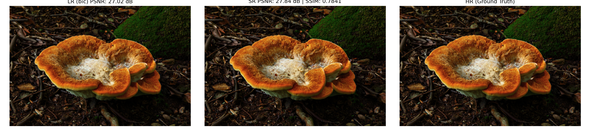
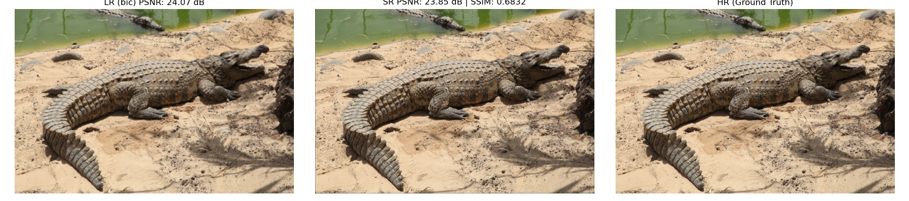
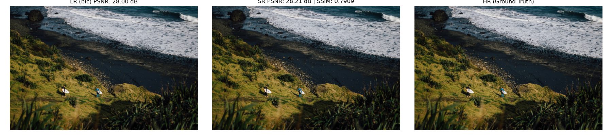
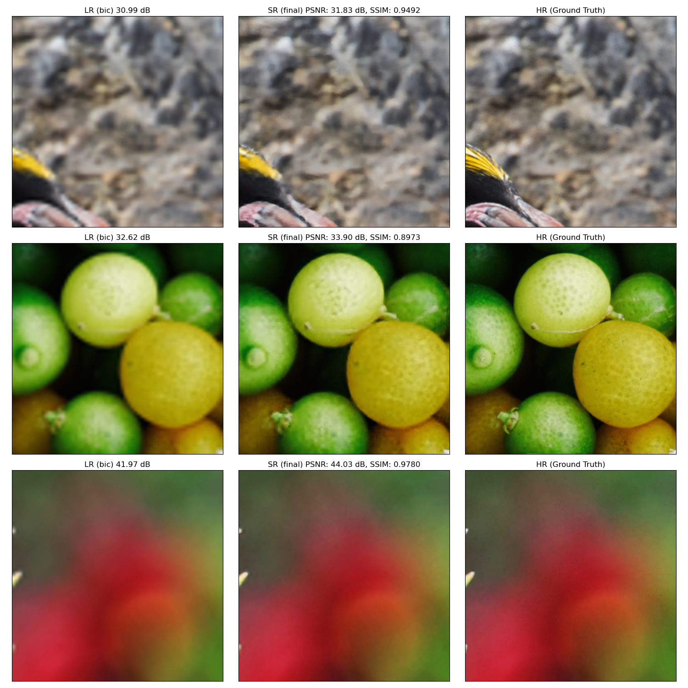

# Efficient Diffusion Models for Image Super-Resolution

##### Neural Networks - Master in Artificial Intelligence and Robotics, Sapienza University of Rome

---

### Authors:
> 1986191: Leonardo Mariut \
> 2190452: Mohamed Zakaria Benjelloun Tuimy

---

## Overview

ResShift improves single-image super-resolution by combining spatial, frequency (DCT - Discrete Cosine Transform), and wavelet (DWT - Discrete Wavelet Transform) representations inside a conditioned diffusion framework. The goal is simple, get sharper textures and cleaner edges than bicubic while keeping model size and inference time comparable to lightweight baselines. The codebase trains a conditional reverse Markov model that starts from a bicubic-upsampled base image (y0) and iteratively refines high-frequency content using a UNet backbone and dual-domain feature streams.

[Main notebook here!](efficient_diffusion_super_res.ipynb)

---

## Aim & approach

The project is built around three simple ideas:

* **Conditioned diffusion sampling** - instead of sampling from pure noise, the reverse chain is conditioned on a bicubic upsample (y0). This biases the sampler to preserve global structure and speeds up convergence.
* **Dual-domain feature fusion** - the network processes spatial, frequency (DCT), and wavelet (DWT) feature streams in parallel and fuses them before decoding. Frequency streams expose edges and texture coefficients explicitly; wavelets provide multi-scale detail.
* **Lightweight backbone** - a UNet-style encoder/decoder with time conditioning (sinusoidal embeddings to MLP) mixes multi-scale context while keeping parameter counts reasonable.

Together these ideas let the model focus explicitly on high-frequency restoration (edges, texture) while relying on y0 for coarse structure. The eta schedule and kappa coefficient control the forward / reverse noise mixing and are important for stability and perceptual behavior.

---

## Dataset & preprocessing

The experiments use **DIV2K** (800 training HR / 200 validation HR). Training samples are random cropped patches, validation uses full HR images for metric measurement. Low-resolution inputs are produced with bicubic downsampling, the model conditions on bicubic upsampled y0 at the target HR size (×4 by default).

Reproducibility: place DIV2K files under `datasets/DIV2K/`:

```
datasets/DIV2K/train/HR/    # 800 HR images
datasets/DIV2K/valid/HR/    # 200 HR images
```

---

## How to run (notebook / script)

1. Put DIV2K images in `datasets/DIV2K/train/HR/` and `datasets/DIV2K/valid/HR/`.
2. Edit options at the top of the notebook (checkpoint path, `SCALE`, `T_STEPS`, etc.).
3. To resume training, place a `resshift_epoch_{N}.pt` file in `checkpoints/` (notebook auto-detects latest checkpoint). You may also set `RESUME_FROM` to a specific path.
4. Run cells in order. For a quick test, reduce epochs and batch size with the debug flags.
5. Evaluation cell will save LR / SR / HR comparison images under `checkpoints/` and print PSNR / SSIM.

Example project layout:

```
.
├── efficient_diffusion_super_res.ipynb
├── efficient_diffusion_super_res_reformatted.py
├── checkpoints/
│   └── resshift_epoch_*.pt
├── datasets/
│   └── DIV2K/
│       ├── train/HR/
│       └── valid/HR/
└── README.md
```

Sample evaluation output (saved under `checkpoints/`) compares LR (bicubic), SR and HR side by side and prints metrics; the image used in the example shows SR giving a modest PSNR gain and visually improved textures and edges.

---

## References

> [DIV2K Dataset](https://data.vision.ee.ethz.ch/cvl/DIV2K) \
> [Implicit Diffusion Models for Continuous Super-Resolution](https://arxiv.org/abs/2303.16491) \
> [Arbitrary-steps Image Super-resolution via Diffusion Inversion](https://arxiv.org/html/2412.09013v1) \
> [Dual-domain Modulation Network for Lightweight Image Super-Resolution](https://arxiv.org/abs/2503.10047) 
> [Perceptual Losses for Real-Time Style Transfer and Super-Resolution](https://arxiv.org/abs/1603.08155) \
> [NeRF: Representing Scenes as Neural Radiance Fields for View Synthesis](https://arxiv.org/abs/2003.08934) \
> [U-Net: Convolutional Networks for Biomedical Image Segmentation](https://arxiv.org/abs/1505.04597)

---

This repository is focused on practical, reproducible experiments: small model footprint, explicit dual-domain design, and a tiled evaluation path for large images.

More details available in [efficient_diffusion_super_res](efficient_diffusion_super_res.ipynb) notebook.

---

## Some results:

---




---




---




---

Epoch 380 evaluation (256x256 random patch, 3 samples):


